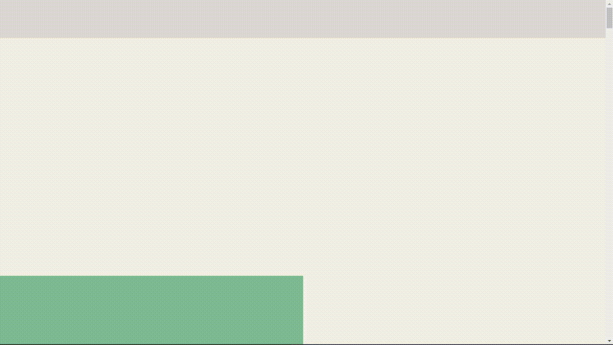

  
  <h1 align="center">Typeform Homepage Clone</h1>

### ✨ Preview

  

## 🏗 Structure
- React JS ⚛
- Styled Components 💅
- Framer Motion 🎨

## ❓ About
This app was made for educational purposes in the mobile front-end development part, it has no connection with the Typeform brand.

## 💪 How you can contribute
- Leave a ⭐ on this repo!
- Open issues!
- Make PR to solve issues!
- Fork and make your own version of it!

<h1 align="center">💥 Thanks for the attention, let's code 🔥</h1>
